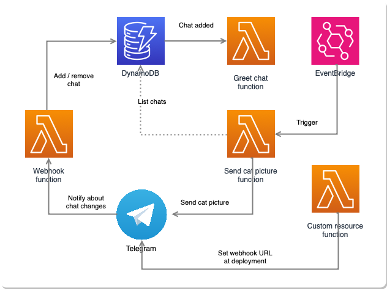

# serverless-telegram-bot

  

A serverless Telegram bot built on top of AWS Lambda using TypeScript & CDK. It sends a wholesome cat picture generated via DALL-E API once a day to all chats its been added to. You can use this as a base for creating serverless bots that broadcast something to all channels on a fixed schedule.

## Usage

In order for the bot to work, you need to add two parameters to Parameter Store before deploying the stack:

- Telegram bot token (for interacting with the Telegram API - you can create the token via Botfather)
- OpenAI API key (for DALL-E picture generation - you can create this via OpenAI)

These can be set with helper scripts:

- `./scripts/add_bot_token_to_ssm.sh your-bot-token-here`
- `./scripts/add_dalle_api_key_to_ssm.sh your-api-key-here`

After you've set these, you can deploy the stack with `npx cdk deploy`.

When you deploy the stack, [a custom CloudFormation resource](./src/lambda/register-webhook.ts) automatically calls the Telegram API and sets the Telegram webhook URL to point to the created lambda function URL. The webhook is also removed via the Telegram API when the stack is torn down, i.e. you do not need to perform any manual operations to set the webhook.

Once your bot is running, add it to your chat. The bot should send a greeting once it's been added. The bot will now send a cat picture once a day to your chat (as well as any other chats it's a part of).

## Architecture

The active chats are stored in DynamoDB using a single table design. That is, there is only a single table and its partition and sort keys can be overloaded to allow storing multiple types of items. So in a nutshell you have:

- chat items (partition key is equal to CHAT, sort key is the numeric identifier of the chat, created timestamp indicates when the bot was added to the chat)
- your own items if you want to customize the bot (use something other than CHAT as partition key and define your own sort key)

This design enables using a single table for the following operations:

- listing all chats (query by using partition key equal to CHAT)
- deleting a chat (delete using partition key equal to CHAT and sort key equal to chat identifier)
- querying your custom items

The obvious drawback with this approach is that since the chats all share the same partition key, listing the chats hits only a single partition, i.e. it's not really scalable. However, since the amount of chats is tiny, this is not really a problem in practice.
